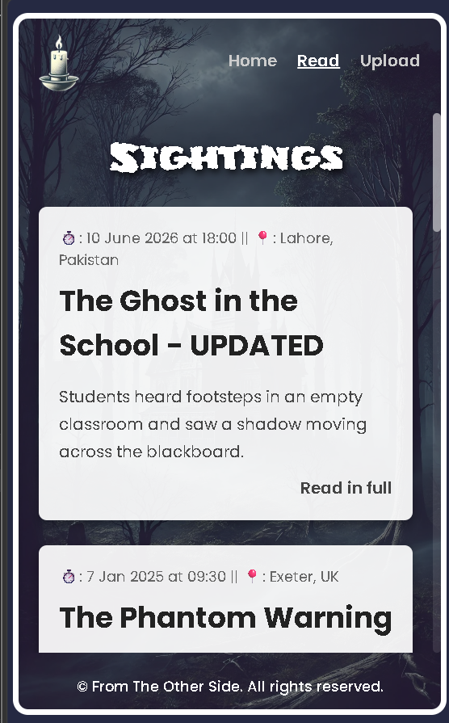
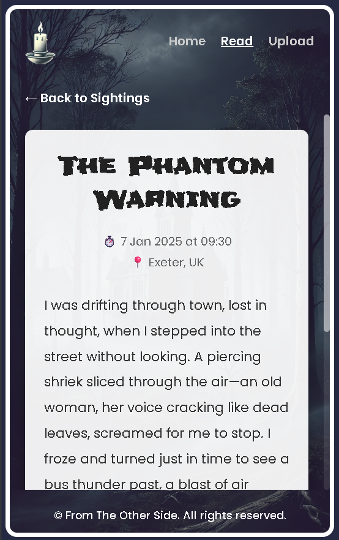
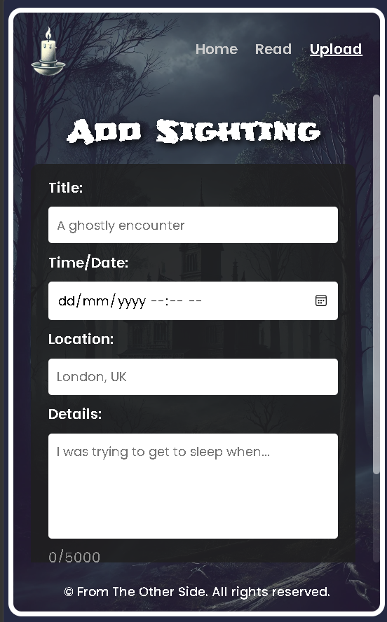
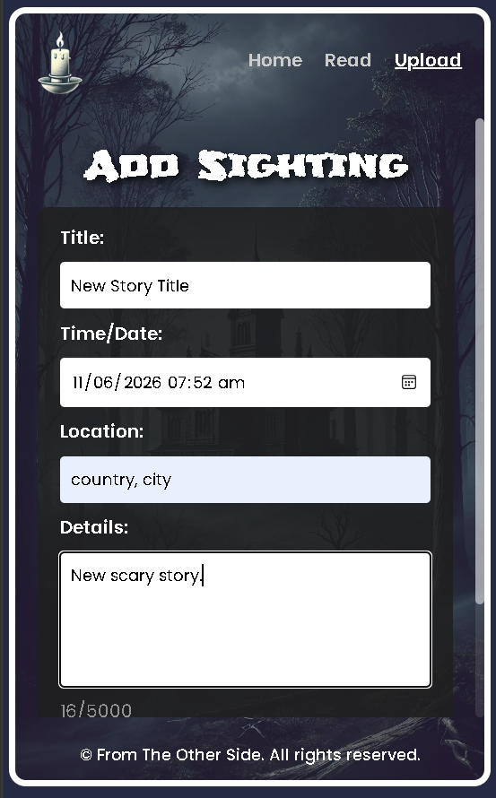
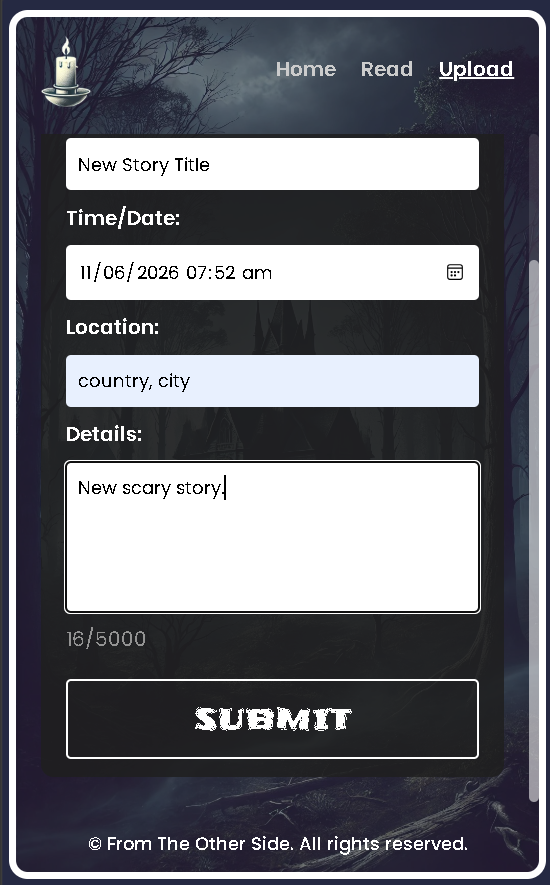
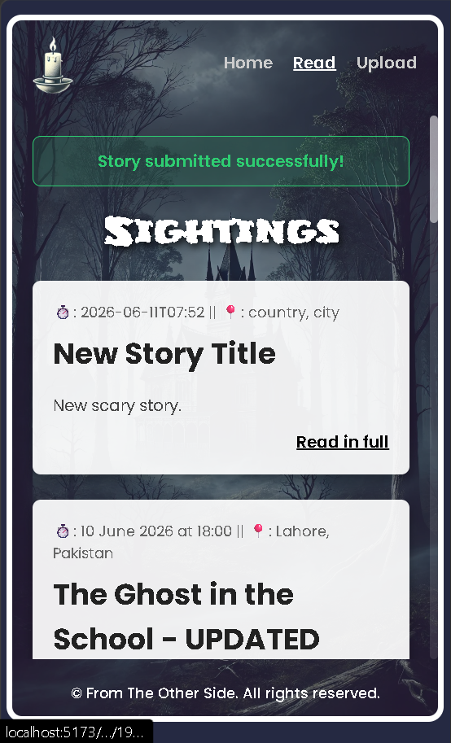
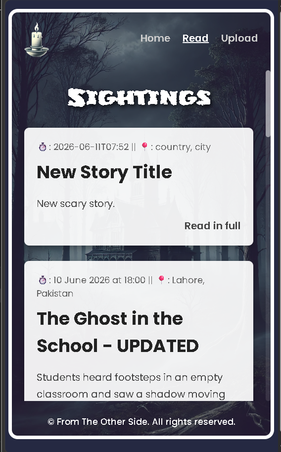

# 👻 From The Other Side

A full-stack paranormal sightings application built with React and Node.js.

Users can browse spooky sightings, read full stories, and submit their own paranormal experiences.

---

## 📸 Screenshots

### Home Page


### Read All Sightings



### Read Single Story



### Add New Sighting



### Form Input



### Submit Story



### Success Message



### Newly Added Story



---

## 🚀 Features

### Frontend

- React
- React Router
- Dynamic Routes
- Fetch API
- Form Validation
- Success Notifications
- Responsive Mobile Layout
- Custom Horror Theme UI

### Backend

- Native Node.js HTTP Server
- REST API Architecture
- JSON File Database
- CRUD Operations
- Request Validation
- Input Sanitization
- Error Handling

---

## 📖 Available Routes

### Frontend

| Route | Description |
|---------|-------------|
| `/` | Home Page |
| `/read` | View All Sightings |
| `/read/:id` | View Single Sighting |
| `/upload` | Submit New Sighting |

---

### Backend API

| Method | Endpoint | Description |
|---------|-----------|-------------|
| GET | `/api/sightings` | Get all sightings |
| GET | `/api/sightings/:id` | Get sighting by ID |
| POST | `/api/sightings` | Create new sighting |
| PUT | `/api/sightings/:id` | Update sighting |
| DELETE | `/api/sightings/:id` | Delete sighting |

---

## 🛠 Tech Stack

### Frontend

- React
- React Router DOM
- CSS

### Backend

- Node.js
- Native HTTP Module
- UUID
- DOMPurify
- JSDOM

### Database

- JSON File Storage

---

## 🔒 Security

This project includes:

- Backend validation
- Frontend validation
- Input sanitization
- Protection against script injection attempts

Example malicious input:

```html
<script>alert("hacked")</script>
```

is sanitized before storage.

---

## 📂 Project Structure

```text
backend
│
├── controllers
├── data
├── utils
├── server.js
│
frontend
│
├── src
│   ├── components
│   ├── pages
│   ├── assets
│   └── App.jsx
```

---

## 🧠 What I Learned

While building this project I practiced:

- REST API Development
- CRUD Operations
- React State Management
- React Router
- Fetch API
- Dynamic Routing
- Form Handling
- Error Handling
- Validation
- Sanitization
- Full Stack Application Structure

---

## 🎯 Future Improvements

Planned ideas for Version 2:

- OpenAI Story Generator
- AI Story Enhancement
- User Authentication
- MongoDB Database
- Express.js Backend
- Search and Filtering
- Story Categories
- Likes and Comments

---

## 🏁 Project Status

✅ Completed

This project was built as a learning project to practice full-stack development before moving on to:

- Express.js
- TypeScript
- NestJS
- Next.js
- Cybersecurity
- DevOps

---

## 👨‍💻 Author

**Fakhar Alam**

GitHub:
https://github.com/ThisisAlam

---

### "Every sighting has a story. Some stories should never be forgotten."
